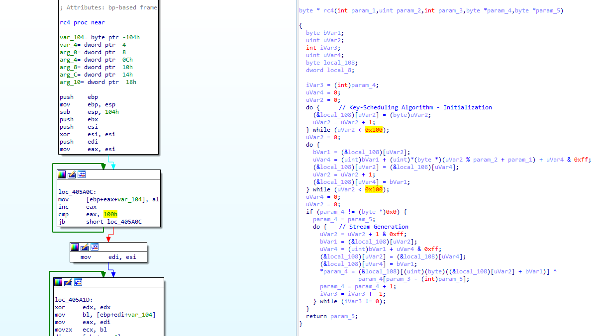
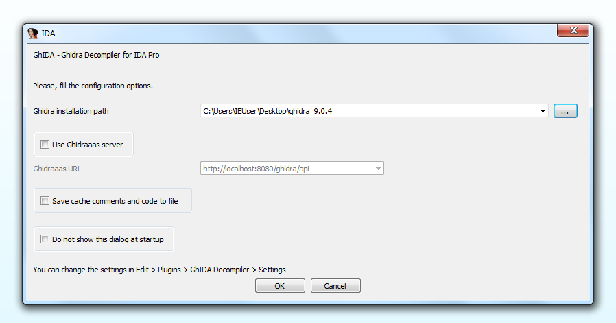

# GhIDA - Ghidra Decompiler for IDA Pro


GhIDA is an IDA Pro plugin that integrates the Ghidra decompiler in IDA.

## How does it work?



Select a function, both in the *Graph view* or in the *Text View*. Then, Press CTRL+ALT+D or (*Edit > Plugins > GhIDA Decompiler*).
Wait a few seconds and a new window will open showing the decompiled code of the function.

GhIDA requires either a local installation of [Ghidra](https://ghidra-sre.org/InstallationGuide.html#Install) or the [Ghidraaas](https://github.com/Cisco-Talos/Ghidraaas) server.

The plugin correctly handles x86 and x64 PE and ELF binaries.

Read more about all the GhIDA features in the **Features** section.

If you want to discover how GhIDA works under the hood, read the **Technical details** section.


## Features


GhIDA provides the following features:
* *Synchronization* of the disassembler view with the decompiler view
* Decompiled code *syntax highlight*
* Code navigation by double-clicking on symbols' name

* Add comments in the decompiler view
* Symbols renaming (limited to XML exported symbols and few others)
* Symbols highlight on disassembler and decompiler view

* Decompiled code and comments cache
* Store setting options.

More information are provided in the **Features description** section.


## Requirements

* GhIDA has a Python 2 and Python 3 version:
    * For Python 2 requires IDA Pro 7.x
    * For Python 3 requires IDA Pro >= 7.4
    * GhIDA is not compatible with *IDA Home*

* `requests` and `pygments` Python (2 or 3) packages

* A local installation of [Ghidra](https://ghidra-sre.org/InstallationGuide.html#Install) or [Ghidraaas](https://github.com/Cisco-Talos/Ghidraaas).
    * Use Ghidra version 9.1.2


## Installation



* Install `requests` and `pygments` in Python 2 or Python 3.
```
pip install requests
pip install pygments
```

* Download the latest release from the [release](https://github.com/Cisco-Talos/GhIDA/releases) page.

* Copy `ghida.py` and the `ghida_plugin` folder in the `plugins` folder of your IDA Pro installation.

* The first time GhIDA is launched (Ctrl+Alt+D or *Edit* > *Plugins* > *GhIDA Decompiler*), a settings form is displayed, as shown in the previous image.
    * If you want to use GhIDA with a local installation of Ghidra:
        * [Download](https://ghidra-sre.org/releaseNotes_9.2.html) and [install Ghidra 9.1.2](https://ghidra-sre.org/InstallationGuide.html#Install)
        * Fill the *installation path* (path of the `ghidra_9.1.2_PUBLIC` folder)

    * Otherwise, if you want to use Ghidraaas:
        * Launch a local instance of the server using the [Ghidraaas](https://github.com/Cisco-Talos/Ghidraaas) docker container
        * Check the *Use Ghidraaas server* box, and insert `http://0.0.0.0:8080/ghidra/api`.

* To run GhIDA:
    * Ctrl+Alt+D
    * *Edit > Plugins > GhIDA Decompiler*
    * (in the disassembler view) *right click > Decompile function with GhIDA*

* To reopen the decompiler view:
    * Either run GhIDA again (see the previous point), or *View > Open subviews > GhIDA decomp view*.


## Suggestions for the best user experience

* Open the decompile view side-to-side with the disassembler view, and keep active the synchronization between the two views.
* When you rename a symbol (e.g., a function name), rename it in the decompile view, it will be updated automatically in the disasm view too.
Otherwise, you will need to delete the decompiled code from the cache and decompile the function again.
* If the program is rebased, all the caches (decompiler, comments, symbol table) are invalidated. Functions must be decompiled again.
* It's possible to change the `TIMEOUT` value for the Ghidra analysis in [ghida_plugin/lib.py](ghida_plugin/lib.py). By default, it's set to 300 seconds, but it may be increased if needed. Please, do not modify the value of `COUNTER_MAX` or `SLEEP_LENGTH`, since they are all related.
## Features description

### Synchronization
By default, the disassembler view is synchronized with the decompiler view. By clicking on different functions both in IDA *Graph view* or *Text View*, the decompiler view is updated accordingly. This behaviour is particularly useful if the decompiler view is displayed side-to-side with the disassembler view.

**To disable the synchronization** (in the disassembler view) *right-click > Disable decompiler view synchronization*.

### Code syntax highlight
Decompiled code is syntax-highlighted using the [pygments](http://pygments.org/) Python library.

### Code navigation
In the decompiler view, double click (or *right-click > Goto*) over the name of a function to open it in the decompile and disassembler view.
If the function has not been decompiled yet, then press CTRL+ALT+D if you want to decompile it.

### Comments
GhIDA allows to insert and update comments in the decompile view. The comment will be displayed at the end of the selected line, separated by `//`.

**To add a comment** (in the decompiler view) press `:` or *right-click > Add comment* and insert the comment in the dialog.

Comments are stored internally, and are automatically added whenever a function is decompiled. They also persist when the GhIDA cached code is invalidated.
Moreover, if the corresponding option is selected in the configuration menu, cached comments are dumped to file and then loaded at the next opening.
The cache is saved in JSON format in the temporary folder.

### Symbols renaming
**To rename a symbol** (in the decompiler view) select the symbol you want rename, press N (or *right-click > Rename*), then insert the new name in the dialog.

Due to the different syntax used by Ghidra and IDA, only a subset of the symbols can be renamed.

### Symbols highlight
In the decompiler view, when clicking on a symbol, all the other occurrences of the same symbol are highlighted. 
The plugin also highlights the corresponding symbols in the disassembler view, but it is limited to XML exported symbols and few others.

### Decompiled code and comments cache
GhIDA cache the results of the decompilation and automatically shows the decompiled code when a cached decompilation is requested.
However, if the user updates the symbols in IDA, or performs any other action that requires the code to be decompiled again, the user can
remove a decompiled code from the cache.

**To remove the code from the cache** (in the disassembler view) *right-click > Clear cache for current function*.

If the corresponding option is selected in the configuration, cached code is dumped to file and loaded at the next opening.
The cache is saved in JSON format in the temporary folder.

### Store setting options
To avoid retype GhIDA configuration each time IDA is opened, the configuration is saved in a JSON file in the temporary folder.


## Technical details

Under the hood, GhIDA exports the IDA project using [idaxml.py](https://github.com/NationalSecurityAgency/ghidra/blob/master/GhidraBuild/IDAPro/Python/7xx/python/idaxml.py), a Python library shipped with Ghidra, then it directly invokes Ghidra in headless mode without requiring any additional analysis. When GhIDA is called the first time, it uses `idaxml` to create two files: a XML file which embeds a program description according to the IDA analysis (including functions, data, symbols, comments, etc) and a `.bytes` file that contains the binary code of the program under analysis. While the binary file does not change during the time, the XML file is recreated each time the user invalidates the GhIDA cache, in order to take into account the updates the user did in the program analysis. To obtain the decompiled code, GhIDA uses [`FunctionDecompile.py`](ghida_plugin/ghidra_plugin/FunctionDecompile.py), a Ghidra plugin in Python that exports to a JSON file the decompiled code of a selected function.

Exporting the IDA's IDB and calling Ghidra in headless mode add a small overhead to the decompilation process, but it allows to abstract the low-level communication with the Ghidra decompiler.


## Development

Ghida outputs to the IDA console some messages related to the main operations, using the following syntax:
* `GhIDA [DEBUG]` display a debug message
* `GhIDA [WARNING]` display a warning message
* `GhIDA [!]` display an error message

### Improvements

* Check the support for other file formats (other than *PE* and *ELF*) and architectures (other than *x86* and *x64*): `idaxml` may require specific checks during the project export phase.
* Improve the syntax conversion [algorithm](ghida_plugin/utility.py) from Ghidra to IDA and vice versa. This will increase the number of symbols that can be highlighted or renamed.
* Add a batch-mode option that decompiles all the functions in the background and cache them.

### Bugs and suggestion

If you discover a bug, or you have any improvements or suggestions, please open an [issue](https://github.com/Cisco-Talos/GhIDA/issues/new).

Be sure to include as many details as possible in order to reproduce the bug.

## License

GhIDA is licensed under the [Apache License 2.0](https://www.apache.org/licenses/LICENSE-2.0).

`idaxml.py` is a [library](https://github.com/NationalSecurityAgency/ghidra/blob/49c2010b63b56c8f20845f3970fedd95d003b1e9/GhidraBuild/IDAPro/Python/7xx/python/idaxml.py) shipped with Ghidra and it is distributed under the [Apache License 2.0](https://github.com/NationalSecurityAgency/ghidra/blob/master/LICENSE).

## Acknowledgement

Thanks to all the people from Talos Malware Research Team for the insightful comments and suggestions.
